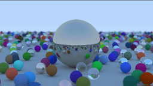
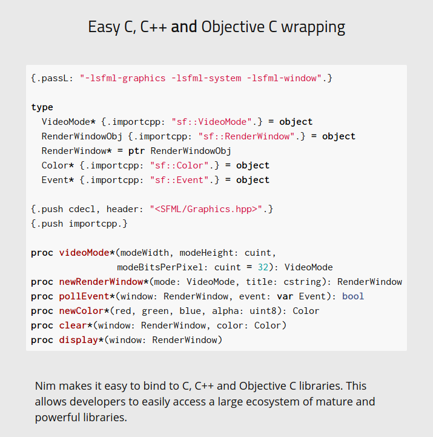

# Trace of Radiance

Trace of Radiance is an implementation
of [Ray Tracing in One Weekend](https://github.com/RayTracing/raytracing.github.io) in the [Nim programming language](https://nim-lang.org/)

The alledged goals are:
- Learn more about Raytracing
- Have fun
- Serve as a testbed for own multithreading runtime, [Weave](https://github.com/mratsim/weave) (TODO)
- Showcase Nim capabilities

In particular, I am convinced (an obviously biaised) that if you want to start
a rendering project (raytracing or otherwise) from scratch, Nim is the best language to use, in particular if you are focus on:
- speed
- correctness
- compilation times and compile-time compute
- approachability & development agility

<p style="text-align: center;">
  
</p>

## Changelog

The writeup below corresponds to v0.1.0. Since then the following updates (not in Shirley's book) have been made:

- Parallelization via [Weave](https://github.com/mratsim/weave), my own state-of-the-art multithreading runtime.
  - Rework of the RNG and sampler for parallel Monte-Carlo simulations
- Simple animation (i.e. no Motion Blur ... yet, only vertical axis, ...)
  - Simple physics engine that can simulate gravity and bounce
  - Exports animation to PPM series 
  - Exports animation to MP4 file format:
    - RGB to Y'CbCr 420 color conversion (often called YUV)
    - Poor Man's H264 encoder
    - MP4 Muxer
  - ⚠️ Warning: very slow since the engine has no
    acceleration structures (Bounding Volume Hierarchy, Kd-Trees, ...)
  - Credits to https://github.com/nwtgck/ray-tracing-iow-scala for the animation idea.

## Table of Contents

- [Trace of Radiance](#trace-of-radiance)
  - [Changelog](#changelog)
  - [Table of Contents](#table-of-contents)
  - [Reproducing](#reproducing)
  - [Speed](#speed)
    - [Raytracing in one Weekend](#raytracing-in-one-weekend)
    - [Smallpt](#smallpt)
  - [Correctness](#correctness)
    - [Distinct types and modeling physics units](#distinct-types-and-modeling-physics-units)
    - [Tracking mutability](#tracking-mutability)
    - [Tracking side-effects](#tracking-side-effects)
  - [Compilation times & Meta-programming](#compilation-times--meta-programming)
  - [C and C++ interop](#c-and-c-interop)
  - [Approachability, productivity & development agility](#approachability-productivity--development-agility)
  - [Caveats](#caveats)

## Reproducing

```
git clone https://github.com/mratsim/trace-of-radiance
cd trace-of-radiance
git checkout v0.1.0
nim c -d:danger --outdir:build trace_of_radiance.nim
./build/trace_of_radiance > image.ppm
```

## Speed

Rendering is an extremely time-consuming task. Nim is fast, very fast, even faster than C++ from time to time.

### Raytracing in one Weekend

> This applies to v0.1.0 of the repo, the repo has been reworked and in particular adds parallelism.

In the RayTracing in One Weekend first book

- Nim 1.2 (GCC 10.1), flag `-d:danger`
- C++ with GCC 10.1, flag `-O3`

On Intel Skylake-X i9-9980XE, overclocked at 4.1GHz all-core turbo.
Compiled in x86-64 mode (SSE2 only)


| Nim     | C++     |
|---------|---------|
| 38.577s | 42.303s |

384x216 image, 100 rays per pixel

The Nim sources for this benchmark can be retrived from the first release:

    https://github.com/mratsim/trace-of-radiance/tree/v0.1.0

### Smallpt

[SmallPT](https://www.kevinbeason.com/smallpt/) is an even smaller raytracing project

<p style="text-align: center;">
  
</p>

Benchmark from Weave multithreading runtime [raytracing demo](https://github.com/mratsim/weave/tree/master/demos/raytracing)


GCC 10 has a significant OpenMP regression

|      Bench       |     Nim     | Clang C++ OpenMP | GCC 10 C++ OpenMP | GCC 8 C++ OpenMP |
| ---------------- | ----------: | ---------------: | ----------------: | ---------------: |
| Single-threaded  | 4min43.369s |        4m51.052s |       4min50.934s |        4m50.648s |
| Multithreaded    |     12.977s |          14.428s |       2min14.616s |          12.244s |
| Nested-parallel  |     12.981s |                  |                   |                  |
| Parallel speedup |      21.83x |           20.17x |             2.16x |           23.74x |

Single-threaded Nim is 2.7% faster than Clang C++.\
Multithreaded Nim via Weave is 11.1% faster Clang C++.

## Correctness

### Distinct types and modeling physics units

Nim is one of the few languages that can properly model physics units
and enforce proper usage of those units at compile-time.

For example, a vector and an unit vector have the same representation but are distinct types. Unit vectors
are auto-convertible to vectors when passed to a function:

```Nim
type
  Vec3* = object
    x*, y*, z*: float64

  UnitVector* {.borrow:`.`.} = distinct Vec3
    # The `.` annotation ensures that field access is possible

converter toVec3*(uv: UnitVector): Vec3 {.inline.} =
  ## UnitVector are seamlessly convertible to Vec3 (but not the otherway around)
  Vec3(uv)
```

Point3 uses the same internal representation as Vec3 and can borrow (share) the implementation of common operators (i.e. no code-size impact)

```Nim
type Point3* {.borrow: `.`.} = distinct Vec3
  # The `.` annotation ensures that field access is possible

func `*=`*(a: var Point3, scalar: float64) {.borrow.}
func `*`*(a: Point3, scalar: float64): Point3 {.borrow.}
func `*`*(scalar: float64, a: Point3): Point3 {.borrow.}
```

Also:
- Substracting 2 points gives a vector,
- Adding a vector to a point gives a point,
- Adding 2 points is disallowed, with a nice custom error message instead of the compiler default errors.

```Nim
func `-`*(a, b: Point3): Vec3 {.inline.}=
  ## Substracting points from one point to the other
  ## gives a vector
  result.x = a.x - b.x
  result.y = a.y - b.y
  result.z = a.z - b.z

func `+`*(p: Point3, v: Vec3): Point3 {.inline.}=
  ## Adding a vector to a point results in a point
  Point3(Vec3(p) + v)

func `-`*(p: Point3, v: Vec3): Point3 {.inline.}=
  ## Substracting a vector to a point results in a point
  Point3(Vec3(p) - v)

func `+`*(a, b: Point3): Point3 {.error: "Adding 2 Point3 doesn't make physical sense".}
```

I also have 2 types for colors and their attenuations (in percentage), so you cannot multiply colors:

```Nim
type Color* {.borrow: `.`.} = distinct Vec3

func `*`*(a, b: Color): Color {.error: "Multiplying 2 Colors doesn't make physical sense".}

type Attenuation* {.borrow: `.`.} = distinct Color

func `*=`*(a: var Attenuation, b: Attenuation) {.inline.} =
  # Multiply a color by a per-channel attenuation factor
  a.x *= b.x
  a.y *= b.y
  a.z *= b.z

func `*`*(a, b: Attenuation): Attenuation {.inline.} =
  # Multiply a color by a per-channel attenuation factor
  result.x = a.x * b.x
  result.y = a.y * b.y
  result.z = a.z * b.z

func `*=`*(a: var Color, b: Attenuation) {.inline.} =
  # Multiply a color by a per-channel attenuation factor
  a.x *= b.x
  a.y *= b.y
  a.z *= b.z
```

Last but not least, ensure you don't mix and match degrees and radians, with auto-conversion of radians to float (and degree would stay at a higher level)

```Nim
type
  Degrees* = distinct float64
  Radians* = distinct float64

template degToRad*(deg: Degrees): Radians =
  Radians degToRad float64 deg

template radToDeg*(rad: Radians): Degrees =
  Degrees radToDeg float64 rad

# For now we don't create our full safe unit library
# with proper cos/sin/tan radians enforcing
# and auto-convert to float
converter toF64*(rad: Radians): float64 {.inline.} =
  float64 rad
```

### Tracking mutability

When using value types (stack objects, seq and strings), Nim requires an
explicit `var` when passing parameters or assigning to a variable for
a parameter to be mutable.

This makes it clear what can or can't move under your feet.

Furthermore, C and C++ developers might be interested to know that
when passing a large object (over 12 bytes on 32-bit and 24 bytes on 64-bit platforms),
Nim does the Right Thing™ and will pass by reference by default
(you can override that on a per-type basis to always pass-by-copy or always by reference). This means that function signatures are motivated by mutability concerns and uncluttered from performance (and performance is great as proven by the benchmarks)

### Tracking side-effects

Nim functions can be declared with `proc` or `func`.

A `func` enforces the absence of side-effect or the code will not compile. For example:
- (non-deterministic) random functions
- accessing a global variable
- multithreading
- IO

If you have a Heisenbug, it's likely not in a side-effect free function (unless you corrupt memory)

This is particularly suited to physics and raytracing computational kernels
as physics equations are side-effect free.

## Compilation times & Meta-programming

Despite all its features, Nim compiles extremely fast with both C and C++ targets.
In particular template metaprogramming has a low low low compilation-time cost.

Nim is the language with the widest support for compile-time metaprogramming, including dependently-typed languages.

This is supported by a fast VM that gives Nim the speed of Python at compile-time and is used for:
- Writing domain specific languages
  - State machine generators
  - Seamless multidimensional arrays uses, including Einstein summation
  - Shader generators
  - SIMD kernel generators
  - ...
- Sompile-time precomputations
- Buffers, vectors, matrices parametrized by integer generics

## C and C++ interop

Nim can compile to both C and C++ and seamlessly call libraries written in either languages. It can even use CUDA with a bit of configuration to call `nvcc`

For example, bindings to SFML, from the Nim website features

<p style="text-align: center;">
  
</p>

## Approachability, productivity & development agility

While Nim offers many advanced features, it does not force you to swim or drown
on first approach.\
Actually many people have reported that Nim felt like a compiled scripting language.

## Caveats

Not all is ponies and rainbows, Nim's main issue is that it is a very young language with a small ecosystem of support libraries.
That said, you can reuse the C and C++ ecosystem (and Javascript as well since Nim can also compile to it).
